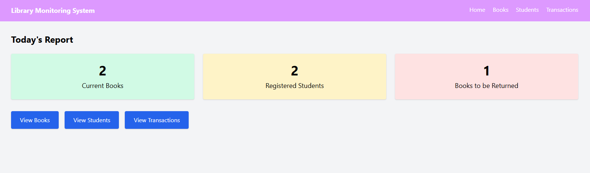
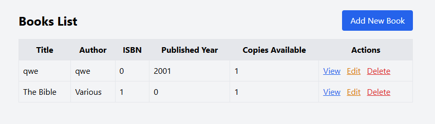
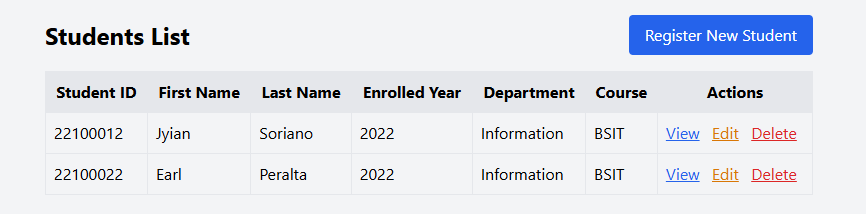
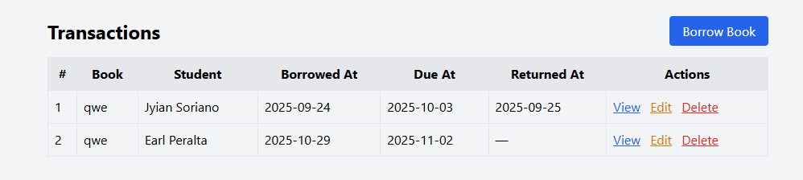

# LibrarySystem (Transaction Processing System)

## Project title

LibrarySystem — Transaction Processing System for a small library (Laravel)

## Description / Overview

LibrarySystem is a lightweight Laravel application that manages books, students (borrowers), and borrow/return transactions. It demonstrates typical library workflows: adding books and students, borrowing books, returning books, and viewing reports on outstanding loans.

## Objectives

- Provide CRUD interfaces for Books, Students, and Transactions.
- Track which student borrowed which book and when it is due.
- Support a simple borrow/return workflow (mark returned, track return date).
- Offer a small dashboard with basic stats for librarians.

## Features / Functionality

- Book management: add, edit, delete books (title, author, ISBN, copies available).
- Student management: register students with an auto-generated student ID.
- Transaction management: create borrow transactions, edit returned date, delete transactions.
- Return workflow: list unreturned books and mark them returned quickly.
- Dashboard: total books, total students, pending/overdue loans.
- Blade templates with simple Tailwind-based styling.

## Installation Instructions

Prerequisites:
- PHP 8.x (as required by your Laravel version)
- Composer
- SQLite (or MySQL/Postgres — update `.env` accordingly)

Quick setup (Windows PowerShell):

```powershell
# clone the repo (if not already)
git clone <your-repo-url> librarySystem
cd librarySystem

# install PHP dependencies
composer install

# copy env and generate key
copy .env.example .env
php artisan key:generate

# ensure database file exists (for SQLite)
# (if using SQLite) create database file
if (-Not (Test-Path database\database.sqlite)) { New-Item database\database.sqlite -ItemType File }

# run migrations and seed (creates sample books, students, transactions)
php artisan migrate --seed

# serve the app
php artisan serve

# open http://127.0.0.1:8000
```

Notes:
- If you use MySQL/Postgres, update `.env` DB settings and create the database before running `php artisan migrate`.
- If migrations fail due to existing schema, consider `php artisan migrate:fresh --seed` while developing.

## Usage

1. Visit the app home (dashboard) to see summary stats.
2. Use the `Books` menu to add or manage books.
3. Use the `Students` menu to register borrowers (student IDs are auto-generated).
4. Use the `Transactions` menu to record a borrow (select book and student, set borrowed/due dates).
5. To return a book, either edit the transaction and set the Returned At date, or use the Return list to mark it returned.

## Screenshots / Code Snippets

Example: Create a transaction (Blade partial snippet)

```blade
<!-- resources/views/transactions/create.blade.php (excerpt) -->
<form action="{{ route('transactions.store') }}" method="POST">
	@csrf
	<select name="book_id">@foreach($books as $book)<option value="{{ $book->id }}">{{ $book->title }}</option>@endforeach</select>
	<select name="student_id">@foreach($students as $s)<option value="{{ $s->id }}">{{ $s->student_id }} - {{ $s->first_name }}</option>@endforeach</select>
	<input type="date" name="borrowed_at" required />
	<input type="date" name="due_at" required />
	<button type="submit">Borrow Book</button>
</form>
```

Screenshots

Below are the UI screenshots (placeholders created from the provided images). Replace these with higher-resolution PNG/JPG screenshots if you prefer — place them under `docs/screenshots/` and update the filenames in this README.









To replace any image, add the new file into `docs/screenshots/` (for example `dashboard.png`) and update the image path above accordingly.

## Contributors

- Earl (WinterBrrr) — primary developer

Feel free to add yourself by editing this file and opening a PR.

## License

This project uses the MIT License by default. See `LICENSE` for details.

---

If you want, I can:

- Add a small `docs/` folder and put example screenshots there.
- Create a short CONTRIBUTING.md with git workflow recommendations.

Let me know which of those you'd like next.
